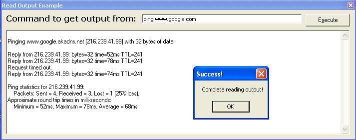



## Read Output from Command Prompt \[Cpu/User\-Friendly Control\]

### Description

This program reads the output of CLI (Command Line Interface) Applications. Examples of CLI Applications are:

-PING

-NETSTAT

-TRACERT

This program will grab the output and call events so that you can process the commands. For example, if you ping a person, the output that is usely returned to the screen by the command prompt is captured and called into an event! This isnt a cheap method, it doesnt use any file input/output.

Please vote if you like, would like to hear complaints about bugs if you find any, but I also appreciate comments ;)

Thanks again

-Endra
 
### More Info
 

             |
---                |---
**Submitted On**   |2004-05-17 13:55:12
**By**             |[AmineHaddad](https://github.com/Planet-Source-Code/PSCIndex/blob/master/ByAuthor/aminehaddad.md)
**Level**          |Advanced
**User Rating**    |4.8 (24 globes from 5 users)
**Compatibility**  |VB 5\.0, VB 6\.0
**Category**       |[Coding Standards](https://github.com/Planet-Source-Code/PSCIndex/blob/master/ByCategory/coding-standards__1-43.md)
**World**          |[Visual Basic](https://github.com/Planet-Source-Code/PSCIndex/blob/master/ByWorld/visual-basic.md)
**Archive File**   |[Read\_Outpu1746715172004\.zip](https://github.com/Planet-Source-Code/aminehaddad-read-output-from-command-prompt-cpu-user-friendly-control__1-53848/archive/master.zip)

